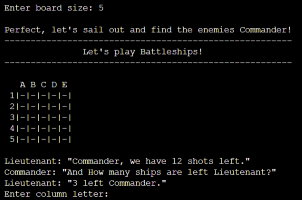
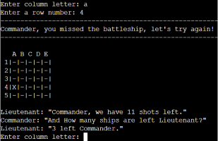
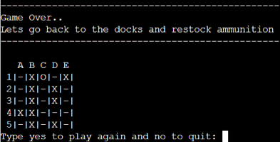
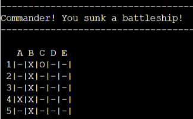
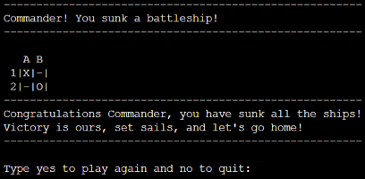

# __Portfolio Project 3 - Battleships__
At the start of the project I was looking forward to not having to worry too much about the style and what the finished end product would look like. I didnt know I could be that wrong. I enjoyed spending quite a bit of time putting in finishing touches trying to make the game look better, but also give a better experience to the user. I am happy with the end product and I hope plenty of people can have fun playing it!

---

## __Planning Phase__
I always had a clear picture in my head of how I wanted to the game look like. I did create a flowchart on paint, which was lost into the unsaved files folder... AKA not to be found ever again. This is something I can learn from, making sure to make a proper plan, since as I move along with a project I should always be able to look back at what my idea was to get myself back on track. A flowchart will also help with keeping the logic simple without overcomplicating steps throughout the creation.

---

## __Features__

### __Existing Features__

- __Welcome Message__
    - First we have the welcome message where the program gives the user an idea of how the game works. 
    - User will also be asked to enter their board size.

- __Creation of the board__
    - Once the grid size is chosen the program will run and create the given board size.
    - There will be a short dialogue underneath the board to give a sense of immersiveness.

- __Missing a ship__
    - Most of the time you will be missing the ships.... If you do miss a ship there will be added an "X" to the position that the user guessed.

- __Game Over__
    - If you are unlucky like me, then you will probably miss all the ships. Once you run out of shots you will get this message:

- __Hitting A Ship__
    - Dont worry, there are ships on the board. If you hit a ship this is what it will look like.
    - An "O" will mark the spot on the board. 

- __Victory Screen__
    - I made a smaller board for myself so it would be easier to get a winning screen. Here is what that would look like:

### __Features Left To Implement__
- Allowing the player to place ships.
- Having larget sized ships and not only 1 unit.
- Once the game is over, reveal where the ships were placed.
- Being able to play 2 player locally.
- Refactoring the code to make it easier to read.
- Create a mode where the computer plays against your own created board.

### __Technologies Used__
- Python
- Heroku

---

## __User Experience__

### __User Stories__ 
- As a user I want to be able to play a logic game.
- As a user, I want to navigate trhough the game easily. 
- As a user, I want to control the board size.
- As a user, I want to play against the computer.

### __Creators Goal__
Goal 1: My goal was to create a computer vs player battleship game where the player would guess where the computer placed their ships. 
Goal 2: In addition I also wanted to create a game mode where the computer would be able to guess where the player had placed his ships.
Goal 3: Have the player determine the grid size.
Goal 4: Let the player have full control of the flow of the game.

---

## __Testing__
First time I checked my problems in the terminal on gitpod I had 100+ errors. Most of them were whitespaces, but some were actually variables that I wasnt using. I was able to clear all of those but I still have 10 more "PROBLEMS" that I am not sure how to go about fixing. If anybody knows a good fix, please reach out to me.

Other than checking and fixing the problems signaled by the terminal I used [CI Python Linter](https://pep8ci.herokuapp.com/) and the results were: all clear, no erros found.

---
## __Deployment__
This project was deployed using Code Institute's mock terminal for Heroku. Below are the steps I followed to be able to deploy the terminal to the website:
1. Create a new Heroku app on the Heroku website.
2. Set config vars: Port and give it a value of 8000.
3. Set buildpacks to Python and NodeJS in that order.
4. Link the Heroku app to the repository on GitHub.
5. Click on Deploy.

---
## __Credits__
- Code Institute for the deployment terminal.
- Mentor for showing me this [YouTube tutorial](https://www.youtube.com/watch?v=MgJBgnsDcF0&ab_channel=CSStudents)  that would help my creation of the project.
- StackOverflow for various problems I faced.

